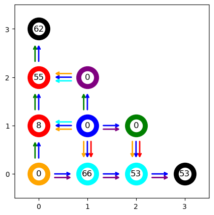
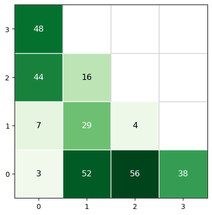
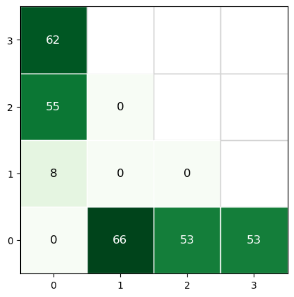

# Schelling Graph
Simulation and visualization for a [Schelling's segregation model](https://en.wikipedia.org/wiki/Schelling%27s_model_of_segregation)

## Installation
```bash
pip install -i https://test.pypi.org/simple/ schelling-graph
```

## Usage
The file `graph_definition.py` contains the definition of the graph `g` used in the examples below.


```python
from graph_definition import g
print(g)
```

    Schelling_Graph with 10 nodes.
    


```python
g.plot(); # show the graph structure
```


    

    


```python
# assign chips
n = len(g.nodes)

q=0.05
p=0.6
pvals = [1/10]*10
g.init_chips_multinomial(pvals)

g_pre = g.copy() # save pre-move state

g.plot_chips();
```


    

    


```python
# Run simulation
logs = g.run_rounds(stop_when=g.is_segregated, max_rounds=5000)
fig, ax = g.plot_chips()
```


    

    


```python
ani = g.animate(interval=200)
```

<html></html>

see the [animation of the simulation](docs/images/schelling_simulation.html).
