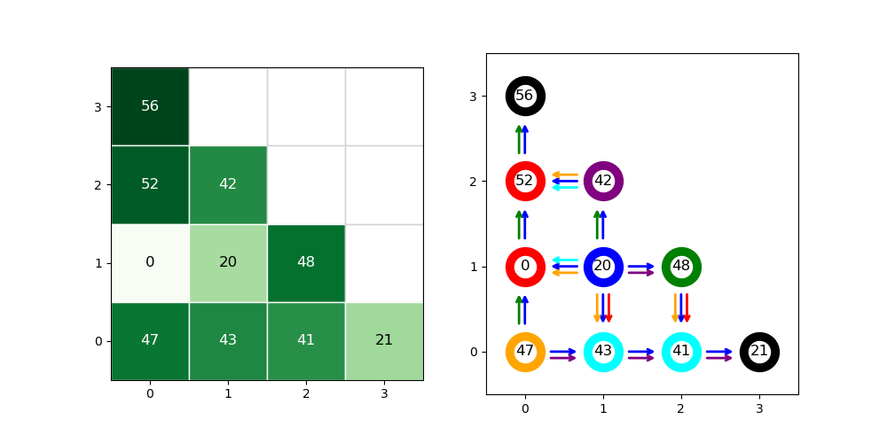
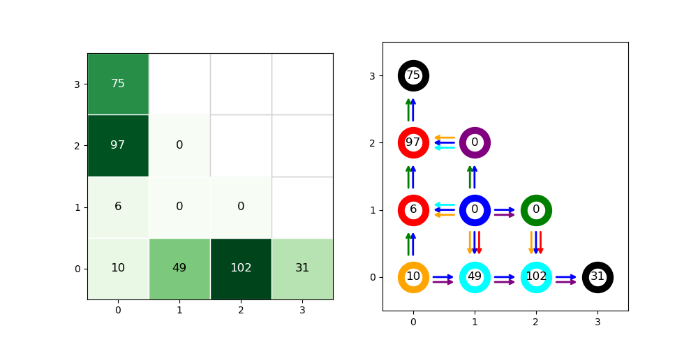

# Schelling's Graph simulation
Simulation and visualization of [Schelling's segregation models](https://en.wikipedia.org/wiki/Schelling%27s_model_of_segregation).

## Installation
```bash
pip install schelling-graph
```

## Usage
The file `graph_definition.py` contains the definition of the graph `g` used in the examples below.

```python
from graph_definition import g              # Import the graph definition
n = len(g.nodes)                            # Number of nodes in the graph     
chips = np.random.randint(0, 60, size=n)    # Randomly generate chips for each node
g.set_chips(chips)                          # Initialize the graph with the generated chips

print(g)
```
Schelling_Graph with 10 nodes.


## 2D Visualization
```python
g.plot()
```



## Run Simulation
```python
logs = g.run_rounds(stop_when=g.is_segregated, max_rounds=5000)
g.plot()
```
